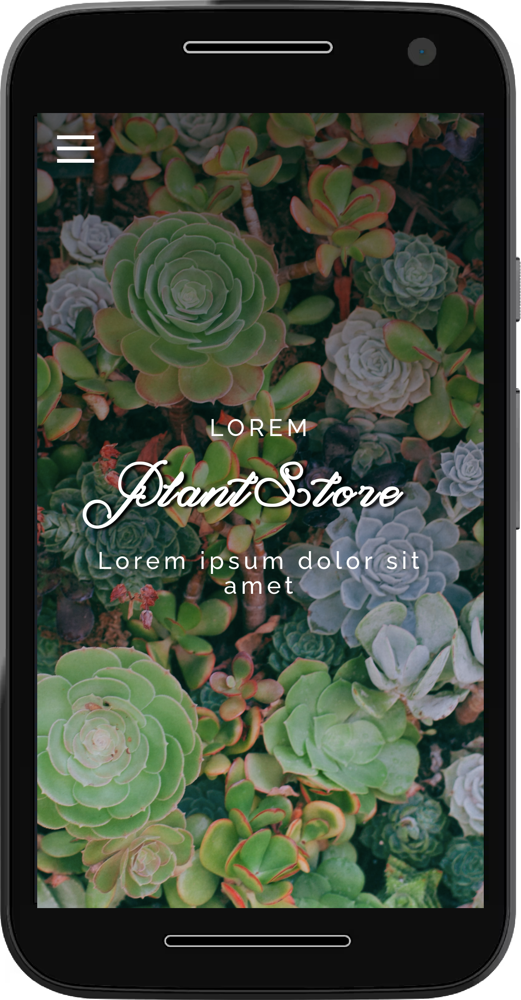

# Succulent Plants Gallery

Get inspired by pictures of succulent plants from photographers around the world.

- Used bootstrap tools & own styles.
- Implemented responsive template.

👉🏻 [Demo](https://albertovargasmoreno.github.io/plant-store/)

## Updates

'till now I've done some changes, and the unfortune has choosen us as its victims:
 
 - I'm unable to link an image locally stored: I get the warn `Invalid source`; that makes me sad :C
 - it works with urls, so I don't have any idea why it has problems with local stored files `¯\_(ツ)_/¯`
 
 branch `glightbox-text` 

 I like it!!, works fine, the only regret I have is that needs to download 2 extra files, but it's ok for now

 in `hacking-up`:

 I am happy, with the results, a good looking menu, and the lightbox functionality

 simple animations added

# My Release

I've done my customization of the [succulent gallery](https://yaninatrekhleb.github.io/succulent-gallery/)

- Adding [this](https://github.com/mblode/burger)
Minimal menu,  
- changed the gallery to be shown with a presentation of [glightbox](https://biati-digital.github.io/glightbox/)
- [Icons](./images/logo/) getted from [fontawesome](https://fontawesome.com)
- Font [Magnolia Light](https://www.1001freefonts.com/es/magnolia.font) added

 question: 

 * [] agregar fotos de nochebuenas
 * [] fotos de plantas

    * https://duckduckgo.com/?q=sizing+images+avoid+distortion+css&t=ffab&ia=web
    * https://www.digitalocean.com/community/tutorials/css-cropping-images-object-fit

 * [] seccion de servicios

---

after updating and editing my menu.css file, and pushing to github, I can not see the expected outcome, the local repository works fine, but online it is the same as the previous commit :thinking:

is there any way to fix that, or is just a matter of time, and wait to reload?, we will see...

yeah, it was just a matter of cleaning the cache
